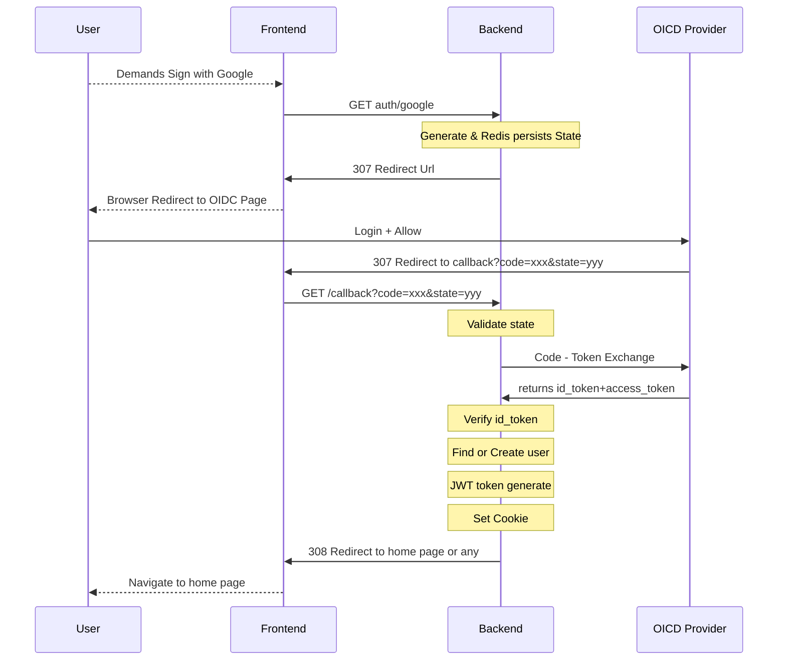

# Backend Learning Path: OAuth2 and OIDC Protocols
> [!NOTE]
> Scope of this repository to **Learn while implementing** the `OpenID Connection Protocol`. 
> Thus this documentation will contain a summarized information about `OIDC Authentication Protocol` and 3 phased implementation
> 1. Phase 1: Creating an authentication server for Google Sign In with `Golang`, without using `oidc and ouath2` package
> 2. Phase 2: Refactoring the application with implementing `oidc` package  
> 3. Phase 3: Refactoring the application with implementing `oath` package
> 4. Phase 4: Refactoring the application with abstraction layers

## OIDC: OpenID Connect Protocol
OpenID Connection Protocol, OIDC, is an identity layer wrapped aroundthe `OAuth 2.0` framework. While OAuth2 mainly aiming providing resource authorization, main purpose of the OIDC is to providing authentication over federated platforms. Once user demands to log with federated identity, they got re-directed to that third parties auth page to identify themselves and return back with their basic profile information. Furthermore, besides authentication and basic profile information different scopes can be used to reach further user data resource.

### How OpenID Connect Protocol Works - Architectural Structure

Given mermaid diagram describes the architectural flow for *authentication with an `OIDC` provider*. Each time an `user` demand to `sign-in` with an `OIDC` provider, application’s backend will redirect them to their desired OpenID site where they login with their federated credentials. 

If visitor successfully login and allow this application to use their given scopes, the `OIDC` provider will redirect them with some artifacts. Demanding application will use these given artifacts to validate user session with issuing a request to identity provider again.

If validation process goes well, consequently application can now find an existing user or create a new one with user_info and generate application wise tokens (optional). 

Finally, application can complete authentication process and redirect user to some home page or dashboard etc.

> [!IMPORTANT]
> One important artifact that application will get at the end of an authentication process is `id_token`. This token will contain a set of personal attributes about authenticated user. These attributes can be used in varying use-cases, most importantly identifying the existing user. Most providers will provide `provider_user_id` or `provider_uid` that can be persisted and used to identify whether it belongs to an existing user.

