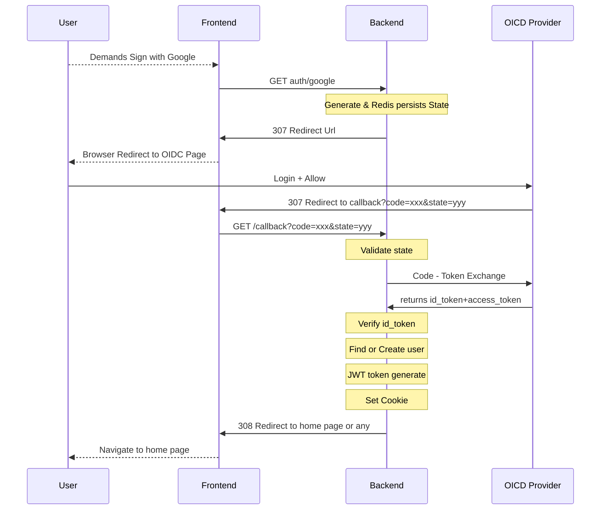

# Backend Learning Path: OAuth2 and OIDC Protocols
> [!NOTE]
> Scope of this repository to **Learn while implementing** the `OpenID Connection Protocol`. 
> Thus this documentation will contain a summarized information about `OIDC Authentication Protocol`and 3 phased implementation for `authentication using the authorization code flow`
> 1. Phase 1: Creating an authentication server for Google Sign In with `Golang`, without using `oidc and ouath2` package
> 2. Phase 2: Refactoring the application with implementing `oidc` package  
> 3. Phase 3: Refactoring the application with implementing `oath` package
> 4. Phase 4: Refactoring the application with abstraction layers

## OIDC: OpenID Connect Protocol
OpenID Connection Protocol, OIDC, is an identity layer wrapped aroundthe `OAuth 2.0` framework. While OAuth2 mainly aiming providing resource authorization, main purpose of the OIDC is to providing authentication over federated platforms. Once user demands to log with federated identity, they got re-directed to that third parties auth page to identify themselves and return back with their basic profile information. Furthermore, besides authentication and basic profile information different scopes can be used to reach further user data resource.

### How OpenID Connect Protocol Works - Architectural Structure

OpenID Connect authentication can be performed one of three paths, 
    - `the Authorization Code Flow` where `response_type=code`
    - `the Implicit Flow` where `response_type=id_token%20token` or `response_type=id_token`
    - `the Hybrid Flow`
Mainly the choice of `response_type` parameter is determing the flow type. Flow type determines how the `id_token` and `access_token` are returned to the client.

*[On OpenID specs page](https://openid.net/specs/openid-connect-core-1_0.html#Authenticaiton)* the characteristics of the three flows are summarized as follows. 
| Property | Authorization Code Flow | Implicit Flow | Hybrid Flow |
| --------------- | --------------- | --------------- | --------------- |
| All Tokens returned from **Authorization Endpoint** | No | Yes | No |
| All tokens returned from **Token Endpoint**  | Yes | No | No |
| Tokens are **exposed** to **User Agent**  | No | Yes | Yes |
| Client can be authenticated | Yes | No | Yes |
| Refresh Token is possible | Yes | No | Yes |
| Most communication is **server-to-server** | Yes | No | Varies|

The flow used is determined by the `response_type` value contained in the *Authorization Request*. These `response_type` values select these follows:
| response_type | Flow |
| -------------- | --------------- |
| code | Authorization Code |
| id_token | Implicit Flow |
| id_token token | Implicit Flow |
| code id_token | Hybrid Flow |
| code token | Hybrid Flow |
| code id_token token | Hybrid Flow |

#### Authentication using the Authorization Code Flow

When using the *Authorization Code Flow* all tokens are returned from the *Token Endpoint*. 

The Authorization Code Flow returns an `authorization_code` to the Client, which can then exchange it for an `id_token` and `access_token` directly from *Token Endpoint*. This provides the benefit of *not exposing any tokens to the User Agent.* This will provide security over malicious applications with access to the User Agent.

Given mermaid diagram describes the architectural flow for *OIDC Authorization Code Flow*. Each time an `user` demand to `sign-in` with an `OIDC` provider, application’s backend will redirect them to their desired OpenID site where they login with their federated credentials. 

If visitor successfully login and allow this application to use their given scopes, the `OIDC` provider will redirect them with some artifacts. Demanding application will use these given artifacts to validate user session with issuing a request to identity provider again.

If validation process goes well, consequently application can now find an existing user or create a new one with user_info and generate application wise tokens (optional). 

Finally, application can complete authentication process and redirect user to some home page or dashboard etc.

> [!IMPORTANT]
> One important artifact that application will get at the end of an authentication process is `id_token`. This token will contain a set of personal attributes about authenticated user. These attributes can be used in varying use-cases, most importantly identifying the existing user. Most providers will provide `provider_user_id` or `provider_uid` that can be persisted and used to identify whether it belongs to an existing user.

### The ID Token

The primary extension that OIDC makes to OAuth2.0 is to enable End-Users to be **Authenticated** with `id_token` data structure. The `id_token` is a security token that contains `Claims` about the *Authentication of an End-User* by an Authorization Server when using a Client and potentially other requested Claims. The `id_token` is represented as a `JWT`.

- iss (Issuer)
Identifies the authentication server that issued the token. Used to verify the token comes from the expected authority.
- sub (Subject)
A unique and stable identifier for the user within the issuer. It is used by the client to recognize the user.
- aud (Audience)
Specifies which client (client_id) this token is intended for. The client must reject the token if it does not match its own client_id.
- exp (Expiration Time)
The time after which the token must no longer be accepted. Prevents the use of old or stolen tokens.
- iat (Issued At)
The time when the token was created. Helps determine how old the token is.
- auth_time
The time when the user actually authenticated (logged in). Used when enforcing session age (e.g., with max_age).
- nonce
A value sent by the client and returned in the token to prevent replay attacks. The client must verify it matches the original request.
- acr (Authentication Context Class Reference)
Indicates the assurance or security level of the authentication performed (e.g., MFA vs basic login).
- amr (Authentication Methods References)
Lists the authentication methods used (e.g., password, OTP). Shows how the user was authenticated.
- azp (Authorized Party)
Identifies the client that the token was issued to, mainly used when multiple audiences are present. Ensures the correct client is authorized to use the token.

